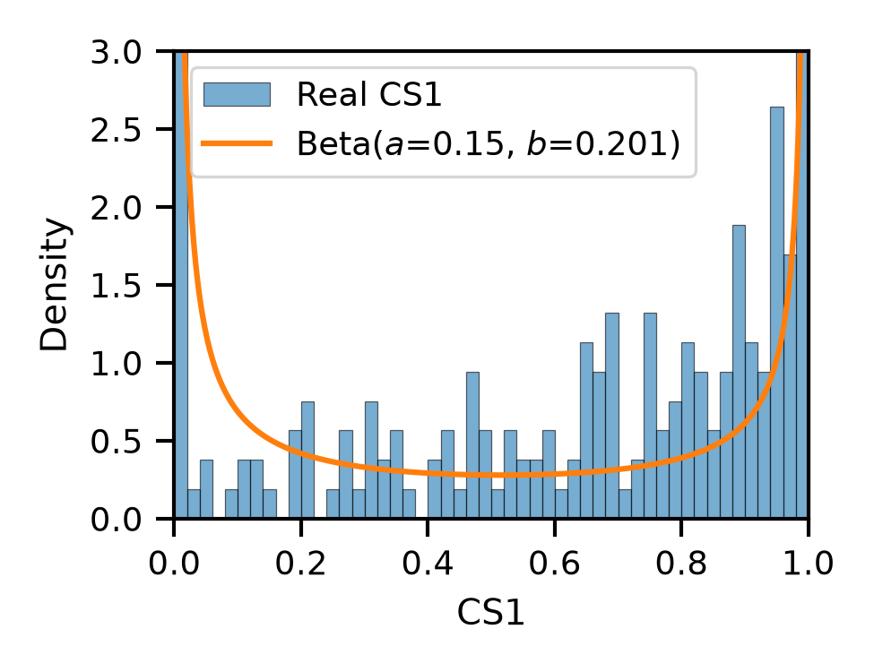
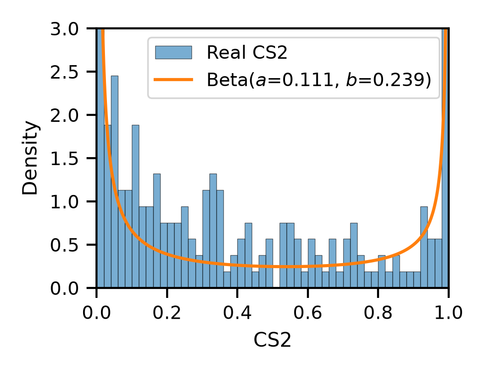
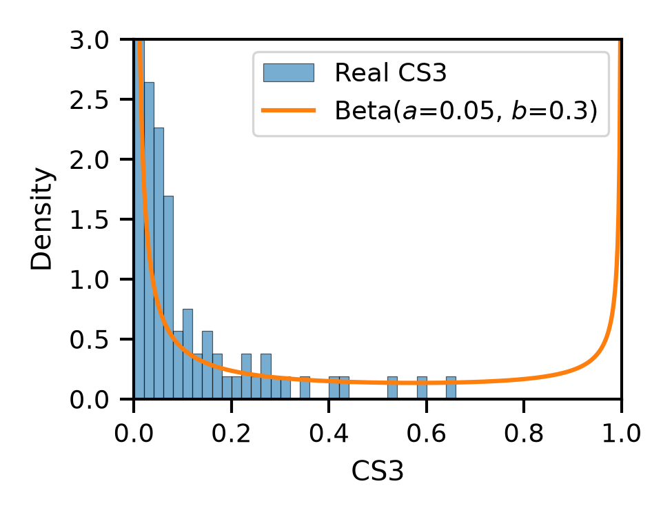
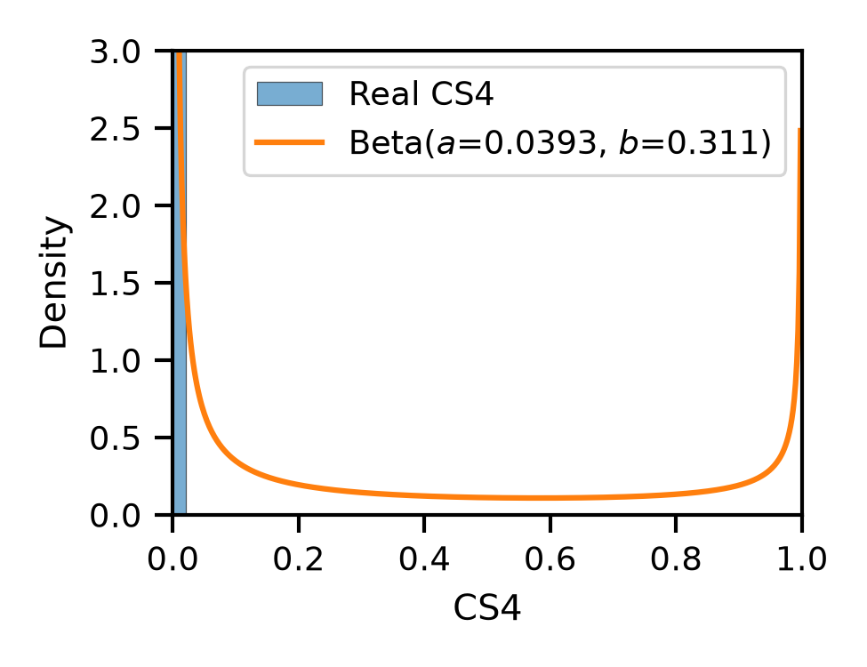

# Actor-Critic vs. Dynamic Programming for Bridge-Element Maintenance

> Life-cycle-cost-optimal maintenance planning for a deteriorating bridge
> element, framed as a Markov Decision Process and solved with **Dynamic
> Programming** (an exact baseline) and **PPO actor-critic Reinforcement
> Learning** — with **interpretable soft/oblique decision-tree policies** and a
> statistical front-end that fits the initial condition-state distribution from
> **real National Bridge Element (NBE) inspection data**.

<p align="left">
  
  
  
  
</p>

---

## Table of contents

- [Motivation](#motivation)
- [What this repository does](#what-this-repository-does)
- [Problem formulation](#problem-formulation-the-mdp)
- [Repository structure](#repository-structure)
- [Installation](#installation)
- [Usage](#usage)
- [Methodology](#methodology)
- [Results](#results)
- [Roadmap](#roadmap)
- [Citation](#citation)
- [License](#license)

---

## Motivation

Bridge owners must decide **when and how** to intervene on aging elements —
*do nothing*, *maintain*, *repair*, *rehabilitate*, or *replace* — under
uncertainty about how the element deteriorates. Choosing well minimizes the
**life-cycle cost (LCC)**: the discounted sum of intervention costs plus the
expected cost of failure.

This project treats that decision problem as a **Markov Decision Process (MDP)**
and asks a practical research question:

> Can a learned **actor-critic RL policy (PPO)** match the **provably optimal
> dynamic-programming policy** on this problem — and can we distill the learned
> policy into a **small, interpretable decision tree** an engineer would trust?

To make the study realistic, the *initial* condition of an element is not
assumed; it is **estimated from real inspection data** by fitting Dirichlet and
Multinomial models via Maximum Likelihood and the Method of Moments.

## What this repository does

| Component | File(s) | Description |
|---|---|---|
| **Environment** | `bridge_gym/example_nbe107/` | A `gymnasium` MDP for a single steel girder/beam element (NBE 107): 4 condition states, 5 maintenance actions, cost-shaped reward. |
| **Dynamic Programming** | `DPvsPPO.py` | Finite-horizon and stationary value iteration; the exact optimal baseline. Includes a hand-verified toy example. |
| **PPO actor-critic** | `softtree_ppo/` | A TorchRL PPO trainer (`PPOTrainer`) plus a soft-tree variant with entropy/L1/L2/group-L1 regularization and β-annealing. |
| **Interpretable policies** | `softtree/` | Soft decision-tree classifier, pruning, and conversion to a compact **oblique decision tree** with text/Graphviz visualization. |
| **Data modeling (MLE/MoM)** | `Dir_MLE_MOM_MultiNomin.py` | Fits Dirichlet (MLE with analytic gradient, L-BFGS-B) and Multinomial models to NBE condition-state percentages; ternary/marginal diagnostics and KS goodness-of-fit. |
| **Convergence & stats** | `convergence.py`, `eval_stats.py` | Mean ± 95% CI of episode returns and a precision-based stopping rule for the number of evaluation episodes. |

## Problem formulation (the MDP)

- **State** — a probability distribution over 4 condition states
  `[CS1, CS2, CS3, CS4]` (best → worst), optionally augmented with normalized
  time. The initial state is sampled from a `Dirichlet(α)` fitted to real data.
- **Actions** — `{0: Do nothing, 1: Maintenance, 2: Repair, 3: Rehabilitation,
  4: Replacement}`, each with its own Markov transition matrix and unit cost.
- **Dynamics** — `s' = Pᵀ(a) · s`, renormalized for numerical stability.
- **Reward** — the negative of the per-step cost,

  ```
  cost(s, a) = unit_cost(a)·s  +  (p_fail·s)·failure_cost
  reward     = −cost                         (discounted by γ = 1/1.03)
  ```

- **Objective** — maximize expected discounted return ⇔ **minimize LCC**.

Deterioration and cost assumptions are documented inline in
`bridge_gym/example_nbe107/settings.py` (transition matrices adapted from
Thompson et al. 1998, CoRe element 107, migrated to the NBE convention per the
AASHTO Bridge Element Inspection Manual).

## Repository structure

```
actCrit-vs-DynPrg-RL-MLE/
├── DPvsPPO.py                     # DP value iteration + evaluation in the RL env
├── Dir_MLE_MOM_MultiNomin.py      # Dirichlet/Multinomial fitting to NBE data
├── convergence.py                 # Episode-count convergence analysis
├── eval_stats.py                  # Mean & confidence-interval helper
│
├── bridge_gym/                    # Gymnasium environment package
│   ├── debug_example_nbe107.py    # Manual rollout / env-spec sanity checks
│   └── example_nbe107/
│       ├── settings.py            # Transition matrices, costs, failure probs
│       ├── rl_env.py              # SingleElement gym.Env
│       └── cost_util.py           # Cost → reward transforms
│
├── softtree/                      # Interpretable decision-tree tooling
│   ├── softtree_classification.py # Differentiable soft decision tree
│   ├── training_util.py           # Supervised soft-tree training loop
│   ├── extraction_util.py         # Node pruning
│   └── oblique_tree.py            # Soft tree → compact oblique tree (+viz)
│
├── softtree_ppo/                  # PPO actor-critic training
│   ├── training.py                # PPOTrainer / SofttreePPOTrainer
│   ├── rl_util.py                 # Actor & critic networks
│   └── settings.py
│
├── V1_.. V4_Datainfobridge*/      # NBE inspection exports (input data)
├── plot/                          # Generated figures
├── requirements.txt
├── CITATION.cff
└── LICENSE
```

## Installation

Requires **Python 3.10+**.

```bash
git clone https://github.com/SAMIRHOSEIN/actCrit-vs-DynPrg-RL-MLE.git
cd actCrit-vs-DynPrg-RL-MLE

python -m venv .venv
source .venv/bin/activate          # Windows: .venv\Scripts\activate

pip install -r requirements.txt
```

> **TorchRL note.** `torchrl` and `tensordict` are tightly version-coupled;
> install matching releases. The code targets a recent TorchRL (≈0.11) — see the
> comments in `softtree_ppo/training.py` for the older 0.9.2 API equivalents.
>
> **Graphviz note.** Rendering oblique-tree diagrams needs the Graphviz *system*
> package in addition to the `graphviz` Python binding
> (`apt install graphviz` / `brew install graphviz`).

## Usage

**1 — Fit the initial condition-state distribution from inspection data**

```bash
python Dir_MLE_MOM_MultiNomin.py
```
Estimates `Dirichlet(α)` and Multinomial parameters, runs a synthetic
parameter-recovery sanity check, and writes marginal-fit figures to `plot/`.
The fitted `α` feeds the environment's `dirichlet_alpha` reset distribution.

**2 — Solve and evaluate the Dynamic-Programming policy**

```bash
python DPvsPPO.py
```
Runs value iteration (stationary by default; set `ELE_DP_INC_STEP = True` for
finite-horizon), evaluates the DP policy in the environment over many episodes,
and reports mean episode return with a 95% confidence interval.

**3 — Assess evaluation-count convergence**

```bash
python convergence.py
```
Parses the printed `mean / 95% CI / SD / N` summary lines and reports the
smallest N whose CI half-width falls within the relative tolerance.

**4 — Sanity-check the environment**

```bash
python -m bridge_gym.debug_example_nbe107
```
Manual rollout plus a TorchRL `check_env_specs` integrity test.

> The PPO trainer lives in `softtree_ppo/training.py` (`PPOTrainer` /
> `SofttreePPOTrainer`) and is driven programmatically; see
> [Roadmap](#roadmap).

## Methodology

**Dynamic Programming (exact baseline).** Both finite-horizon backward induction
and infinite-horizon discounted value iteration are implemented from first
principles for transparency, and validated against a 2-state / 2-action example
with hand-computed values.

**PPO actor-critic (learned policy).** Built on TorchRL with GAE, clipped
surrogate loss, optional entropy bonus, and L1/L2/group-L1 actor regularization.
A soft-tree variant additionally anneals the routing temperature (β) during
training so the policy sharpens toward hard, interpretable splits.

**Interpretable policies.** A trained soft decision tree is pruned and converted
into a compact **oblique decision tree** whose splits are linear rules on the
condition-state vector — small enough to read and audit.

**Data modeling (MLE / MoM).** The Dirichlet fit uses L-BFGS-B with an analytic
gradient and a method-of-moments initialization (Minka / Ronning); fit quality
is checked with ternary KDE plots, per-CS Beta marginals, and KS goodness-of-fit.

## Results

Fitted **per-condition-state marginals** (real data vs. the Beta marginal
implied by `Dirichlet(α̂)`) are produced by `Dir_MLE_MOM_MultiNomin.py`:

<p align="left">
  
  
  
  
</p>

`DPvsPPO.py` additionally reports the **initial reliability index β vs. episode
LCC** relationship, the action distribution, and a color-coded action timeline
for representative episodes; `convergence.py` shows how the return estimate
tightens as the evaluation-episode count grows.

> Quantitative DP-vs-PPO comparison tables are part of the ongoing study and
> will be summarized here as they are finalized.

## Roadmap

- [ ] Add a runnable PPO training entry-point script (train → evaluate →
      compare against the DP baseline in one command).
- [ ] Publish a consolidated DP-vs-PPO results table and figures.
- [ ] Package the modules (`pyproject.toml`) for `pip install -e .`.
- [ ] Add unit tests for the environment dynamics and value-iteration correctness.

## Citation

If you use this code or its results, please cite it via
[`CITATION.cff`](CITATION.cff). A citable publication reference will be added
here once available.

## License

Released under the [MIT License](LICENSE). © 2025 Amir Moayyedi.
